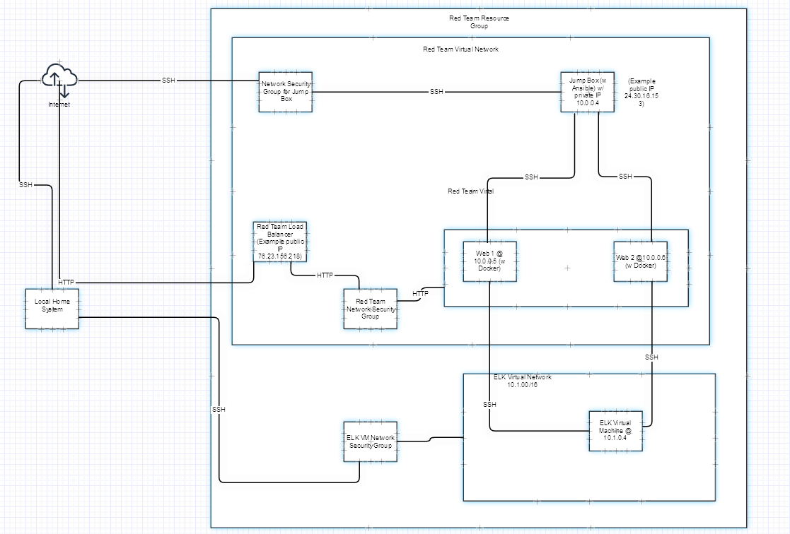
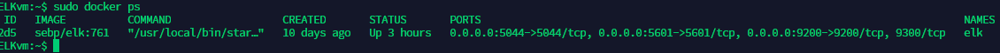

## Automated ELK Stack Deployment

The files in this repository were used to configure the network depicted below.

**Note**: The following image link needs to be updated. Replace `diagram_filename.png` with the name of your diagram image file.  

These files have been tested and used to generate a live ELK deployment on Azure. They can be used to either recreate the entire deployment pictured above. Alternatively, select portions of the ansible file may be used to install only certain pieces of it, such as Filebeat.

  - 

This document contains the following details:
- Description of the Topologu
- Access Policies
- ELK Configuration
  - Beats in Use
  - Machines Being Monitored
- How to Use the Ansible Build

### Description of the Topology

The main purpose of this network is to expose a load-balanced and monitored instance of DVWA, the D*mn Vulnerable Web Application.
  
  Load balancing ensures that the application will be highly available, in addition to restricting access to the network.
- Load balancers functions as a reverse proxy distributes traffic across the servers placed behind it.  They increase the amount of simultaneous users by redirecting to another server before the first one is overloaded.  This essentially helps to prevent DOS attacks and also assure availability.  
  A jump box is a secure system that admins connect for systems administration to other servers in the network.  It sits in a separate "zone" than the servers behind it.  It is a hardened system that "jumps" through these different zones to access the other servers.

Integrating an ELK server allows users to easily monitor the vulnerable VMs for changes to the data and system logs.
- Filebeat is a monitoring system for logged events, and log files.  It is highly customizable.
- Metricbeat enables system and services metrics montitoring on the server.

The configuration details of each machine may be found below.
_Note: Use the [Markdown Table Generator](http://www.tablesgenerator.com/markdown_tables) to add/remove values from the table_.

| Name     | Function | IP Address | Operating System |   |
|----------|----------|------------|------------------|---|
| Jump Box | Gateway  | 10.0.0.4   | Ubuntu 18.04     |   |
| Web 1    | VM       | 10.0.0.5   | Ubuntu 18.04     |   |
| Web 2    | VM       | 10.0.0.6   | Ubuntu 18.04     |   |
| ELK-VM   | VM       | 10.1.0.4   | Ubuntu 18.04     |   |

### Access Policies

The machines on the internal network are not exposed to the public Internet. 

Only the jump box machine can accept connections from the Internet. Access to this machine is only allowed from the following IP addresses:
- 70.187.184.140

Machines within the network can only be accessed by SSH.
- The Jump Box @ 10.0.0.4 is allowed to access the ELK server
A summary of the access policies in place can be found in the table below.

| Name     | Internet Facing? | IP Address     |
|----------|------------------|----------------|
| Jump Box | No               | 70.187.184.140 |
| Web 1    | No               | 10.0.0.4       |
| Web 2    | No               | 10.0.0.4       |
| ELK-VM   | No               | 10.0.0.4       |

### Elk Configuration

Ansible was used to automate configuration of the ELK machine. No configuration was performed manually, which is advantageous because...
- When configuring multiple machines automating any given task is always more efficient than manual config.
The playbook implements the following tasks:
- _TODO: In 3-5 bullets, explain the steps of the ELK installation play. E.g., install Docker; download image; etc._
- 1. Install Docker
- 2. Install python-pip
  3. Increase virtual memory w the following command:  sysctl -w vm.max_map_count=262144
  4. Install ELK container
  5. Enable Docker on boot

The following screenshot displays the result of running `docker ps` after successfully configuring the ELK instance.

### Target Machines & Beats
This ELK server is configured to monitor the following machines:
- Web 1 @ 10.0.0.5 and Web 2 @ 10.0.0.6

We have installed the following Beats on these machines:
- Metricbeat
  Filebeat

These Beats allow us to collect the following information from each machine:
- Filebeat collects audit logs, deprecation logs, gc logs, server logs, and slow logs.
  Metricbeat collects metrics and statistics from the system and services running on the server.

### Using the Playbook
In order to use the playbook, you will need to have an Ansible control node already configured. Assuming you have such a control node provisioned: 

SSH into the control node and follow the steps below:
- Copy the /etc/ansible/files/filebeat-config.yml file to /etc/filebeat/filebeat.yml.
- Update the config file to include elkserver ip for output.elasticsearch and setup.kibana
- Run the playbook, and navigate to Kibana (http://[ELKvmPublicIP]:5601/app/kibana#) to check that the installation worked as expected.
